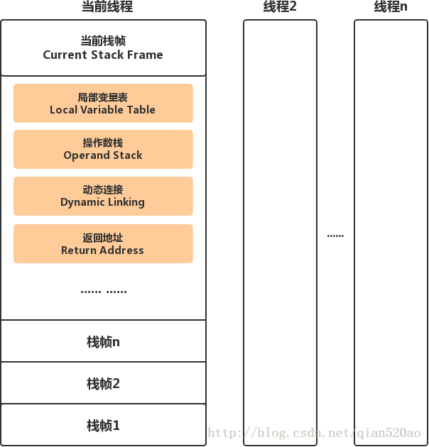

# SimpleTuning
Simple JVM  Tuning simulation

# 运行
> * 设置参数 有一点需要注意的是，如果-Xms和-Xmx没有被设定成相同的值，而且-Xmn被使用了，当调整Java堆的大小的时候，
 >*  vm_1 : 默认：-Xms:默认为物理内存的1/64 -Xmx:默认为物理内存的1/4或者1G,
 因为存在堆空间扩容，第一次运行的时候会执行多次FULL GC,通过关闭自适应调整策略(-XX:-UseAdaptiveSizePolicy)，
 JVM已经事先被禁止动态调整内存池的大小。
> * -XX:+PrintGCDetails
 > * -XX:+UseG1GC -XX:+UseConcMarkSweepGC -XX:+UseParallelGC -XX:+UseSerialGC  除了使用G1算法外，其他的算法实际返回用户可视化的可用空间都将少一个Survivor区的大小的空间
 >  -XX:+PrintGCApplicationStoppedTime -XX:+PrintGCApplicationConcurrentTime 获取完整的安全点日志
     -Djava.util.concurrent.ForkJoinPool.common.parallelism=核数*2    IO操作时会有很多CPU处在闲置，使用默认线程池个数(机器核数)这样可能会丢失7%的性能，此参数修改ForkJoin的线程池个数，
    
>*  vm_1 : 默认：-Xms:默认为物理内存的1/64 -Xmx:默认为物理内存的1/4或者1G
 >*  vm_2 : -Xms750m -Xms2048m -Xmx2048m
 >*  vm_3 : -Xms1024m -Xms2048m -Xmx2048m
 >*  vm_4 : -Xms1024m -Xms3096m -Xmx3096m
 >*  vm_5 : -Xms250m -Xms1024m -Xmx1024m

# 记录书籍例子以及怪异的面试题

## Integer类
  [x] Integer类Cache，以及反射修改导致的问题.
  
    @ jdkcode.IntegerCode
 ---
 
 
 ##  类加载
  **<font color=red>以下整理自 <<深入理解 JAVA虚拟机>></font>**
### **加载**
 > “加载”(Loading)阶段是“类加载”(Class Loading)过程的第一个阶段，在此阶段，虚拟机需要完成以下三件事情：

     1、 通过一个类的全限定名来获取定义此类的二进制字节流。
     2、 将这个字节流所代表的静态存储结构转化为方法区的运行时数据结构。
     3、 在Java堆中生成一个代表这个类的java.lang.Class对象，作为方法区这些数据的访问入口。
   
   加载阶段即可以使用系统提供的类加载器在完成，也可以由用户自定义的类加载器来完成。加载阶段与连接阶段的部分内容(如一部分字节码文件格式验证动作)是交叉进行的，加载阶段尚未完成，连接阶段可能已经开始。
   
 ### **验证**
 * x1: 文件格式验证
 > * 是否以魔数0xCAFEBABE开头。
 > * 主次版本是否在当前虚拟机处理范围之内。
 > * 常量池常量是否有不被支持的类型 (检查常量tag标志)
> * 指向常量的各种索引值重是否有指向不存在的常量或者不符合类型的常量
> * CONSTANT_Utf8_info型的常量中是否有不符合UTF8编码的数据。
> * ......
* x2: 元数据验证
> * 这个类是否有父类 (除了java.lang.Object之外，所有类都应该有父类)
> * .....

* x3: 字节码验证
> * 保证任意时刻操作数栈的数据类型与指令代码序列都能配合工作，例如不会出现在操作栈放置了int类型，使用时却按long类型加载本地变量
> * 保证跳转指令不会跳转到方法体以外的字节码指令上。
> * 保证方法体中的类型转换是有效的。

 * x4: 符号引用验证：
 > * 符号引用验证的目的是确保解析动作能正常执行，如果无法通过验证，则会抛出java.lang.IncompatibleClassChangeError异常的子类, 如java.lang.IllegalAccessError，java.lang.NoSuchFieldError,java.lang.NoSuchMethodError等
  符号引用非必须，所以在编译器反复验证过的情况下，可以使用 -Xverify:none来关闭以增加类加载的速度。

 ### **准备**
 > *准备阶段是正式分配内存并设置类变量初始值的阶段，这些变量将在方法区分配。
 >  * 此阶段只会对类变量进行内存分配，只对类变量进行设置默认值，类中赋予的值putstatic指令是程序编译后，
> 存放在类构造器<clinit\>()方法之中，赋值动作将在初始化阶段才会执行。
> 见例子：classload.LoadClassInit

### **解析**
解析阶段是将常量池中的符号引用替换为直接引用的过程。**在进行解析之前需要对符号引用进行解析，不同虚拟机实现可以根据需要判断到底是在类被加载器加载的时候对常量池的符号引用进行解析（也就是初始化之前），还是等到一个符号引用被使用之前进行解析（也就是在初始化之后）。

到现在我们已经明白解析阶段的时机，那么还有一个问题是：如果一个符号引用进行多次解析请求，虚拟机中除了invokedynamic指令外，虚拟机可以对第一次解析的结果进行缓存（在运行时常量池中记录引用，并把常量标识为一解析状态），这样就避免了一个符号引用的多次解析。

解析动作主要针对的是类或者接口、字段、类方法、方法类型、方法句柄和调用点限定符7类符号引用。这里主要说明前四种的解析过程。

**类或者接口解析**

要把一个类或者接口的符号引用解析为直接引用，需要以下三个步骤：
> 1. 如果该符号引用不是一个数组类型，那么虚拟机将会把该符号代表的全限定名称传递给类加载器去加载这个类。这个过程由于涉及验证过程所以可能会触发其他相关类的加载
 > 2. 如果该符号引用是一个数组类型，并且该数组的元素类型是对象。我们知道符号引用是存在方法区的常量池中的，该符号引用的描述符会类似”[java/lang/Integer”的形式，将会按照上面的规则进行加载数组元素类型，如果描述符如前面假设的形式，需要加载的元素类型就是java.lang.Integer ,接着由虚拟机将会生成一个代表此数组对象的直接引用
 > 3. 如果上面的步骤都没有出现异常，那么该符号引用已经在虚拟机中产生了一个直接引用，但是在解析完成之前需要对符号引用进行验证，主要是确认当前调用这个符号引用的类是否具有访问权限，如果没有访问权限将抛出java.lang.IllegalAccess异常

**字段解析**

对字段的解析需要首先对其所属的类进行解析，因为字段是属于类的，只有在正确解析得到其类的正确的直接引用才能继续对字段的解析。对字段的解析主要包括以下几个步骤：
 > 1. 如果该字段符号引用就包含了简单名称和字段描述符都与目标相匹配的字段，则返回这个字段的直接引用，解析结束
  > 2. 否则，如果在该符号的类实现了接口，将会按照继承关系从下往上递归搜索各个接口和它的父接口，如果在接口中包含了简单名称和字段描述符都与目标相匹配的字段，那么久直接返回这个字段的直接引用，解析结束  
  > 3. 否则，如果该符号所在的类不是Object类的话，将会按照继承关系从下往上递归搜索其父类，如果在父类中包含了简单名称和字段描述符都相匹配的字段，那么直接返回这个字段的直接引用，解析结束
  > 4. 否则，解析失败，抛出java.lang.NoSuchFieldError异常
  > 5. ***见例子：classload.FileResolution***

如果最终返回了这个字段的直接引用，就进行权限验证，如果发现不具备对字段的访问权限，将抛出java.lang.IllegalAccessError异常

**类方法解析**

进行类方法的解析仍然需要先解析此类方法的类，在正确解析之后需要进行如下的步骤：
> 1. 类方法和接口方法的符号引用是分开的，所以如果在类方法表中发现class_index（类中方法的符号引用）的索引是一个接口，那么会抛出java.lang.IncompatibleClassChangeError的异常
 > 
 > 2. 如果class_index的索引确实是一个类，那么在该类中查找是否有简单名称和描述符都与目标字段相匹配的方法，如果有的话就返回这个方法的直接引用，查找结束
 > 
 > 3. 否则，在该类的父类中递归查找是否具有简单名称和描述符都与目标字段相匹配的字段，如果有，则直接返回这个字段的直接引用，查找结束
 > 
>  4. 否则，在这个类的接口以及它的父接口中递归查找，如果找到的话就说明这个方法是一个抽象类，查找结束，返回java.lang.AbstractMethodError异常
 > 
 > 5. 否则，查找失败，抛出java.lang.NoSuchMethodError异常

如果最终返回了直接引用，还需要对该符号引用进行权限验证，如果没有访问权限，就抛出java.lang.IllegalAccessError异常

**接口方法解析**

同类方法解析一样，也需要先解析出该方法的类或者接口的符号引用，如果解析成功，就进行下面的解析工作：
> 1. 如果在接口方法表中发现class_index的索引是一个类而不是一个接口，那么也会抛出java.lang.IncompatibleClassChangeError的异常
 > 
 > 2. 否则，在该接口方法的所属的接口中查找是否具有简单名称和描述符都与目标字段相匹配的方法，如果有的话就直接返回这个方法的直接引用。
 > 
 > 3. 否则，在该接口以及其父接口中查找，直到Object类，如果找到则直接返回这个方法的直接引用
 > 
 > 4. 否则，查找失败

接口的所有方法都是public，所以不存在访问权限问题。

### 初始化
初始化阶段是类加载过程的最后一步，这个阶段才开始真正的执行用户定义的Java程序。在准备阶段，变量已经赋过一次系统要求的初始值，而在初始化阶段，则需要为类变量(非final修饰的类变量)和其他变量赋值，其实就是执行类的<clinit>()方法。在Java语言体系中，<clinit>()是由编译器生成的，编译器在编译阶段会自动收集类中的所有类变量的赋值动作和静态语句块(static{})中的语句合并而成的，编译器收集的顺序是由语句的顺序决定的，静态语句块只能访问到定义在静态语句块之前的变量，定义在静态语句块之后的变量，可以赋值，但是不能访问。

<clinit\>()方法与类的构造方法不同，它不需要用户显示的调用，虚拟机会保证父类的<clinit\>()方法先于子类的<clinit\>()执行，java.lang.Object的<clinit>()方法是最先执行的。接口中不能使用用静态语句块，所以接口的<clinit>()只包含类变量，所以接口的<clinit>()方法执行时，不要求限制性父接口的<clinit>()方法。<clinit>()方法对于类和接口来说不是必须的，如果类或接口中没有定义类变量，也没有静态语句块，那么编译器将不为这个类或者接口生成<clinit>()方法，如果类或者接口中生成了<clinit>()方法，那么这个方法在执行过程中，虚拟机会保证在多线程环境下的线程安全问题。

　　虚拟机规范给了严格规定，有且只有以下几种情况必须立即对类进行初始化：

    1、遇到new、putstatic、getstatic及invokestatic这4条字节码指令时，如果类没有初始化，则立即进行初始化，这4个命令分别代表实例化一个类、设置&读取一个静态字段(没有被final修饰)、调用类的静态方法；
    2、使用java.lang.reflect包的方法对类进行反射调用的时候，如果类没有初始化；
    3、当初始化一个类的时候，发现其父类没有初始化；
    4、当虚拟机启动时，需用将执行启动的主类(有main()方法的那个类)进行初始化；
    5、当使用动态语言时，如果一个java.lang.invoke.MethodHandle实例最终的解析结果是REF_getStatic、REF_putStatic、REF_invokeStatic句柄时，并且这个句柄对应的类没有初始化。

[x] 被动使用字段,导致类没有初始化. 对于必须初始化的反例
 例子： ```@ classload.NotInitialization```
## 类与类加载器
> 对于任意一个类，都需要加载它得加载器和这个类本身一同确立其在Java虚拟机中得唯一性，对于类加载器，都拥有一个独立的类名称空间。
 两个类相同 包括代表类的Class对象的equals()方法，isAssignableFrom()方法，isInstance()方法返回结果，也包括使用instanceof关键字做对象所属关系判定等情况，如果未注意类加载器影响，在某些情况下可能会产生迷惑性结果。
>
 > 例子： classload.ClassLoadDoubleClass

 > 双亲委派
 > > 如果一个类加载器收到了类加载的请求，它首先不会自己去尝试加载这个类，而是把这个请求委派给父类加载器去完成，每一个层次的类加载器都是如此，因此所有的加载请求
 >  最终都应该传送到顶层的启动类加载器中，只有当父加载器反馈自己无法完成这个加载请求(它搜索范围中没有找到所需要的类)时，子加载器才会尝试加载
>
>类加载之间是组合关系，非继承关系。
>由于 类的相同需要与类加载绑定，所以使用双亲委派加载类可以保证rt.jar,bin/lib下面的类都是由系统自身的加载器加载，而不是用户自定义加载，导致多个相同得类存在。


## 虚拟机字节码执行引擎

### 运行时栈帧结构

> 栈帧（Stack Frame）是用于支持虚拟机进行方法调用和方法执行的数据结构。它是虚拟机运行时数据区中的虚拟机栈的栈元素。
>
>  栈帧存储了方法的局部变量表、操作数栈、动态连接和方法返回地址等信息。
>
>  每一个方法从调用开始至执行完成的过程，都对应着一个栈帧在虚拟机里面从入栈到出栈的过程。
> > 在编译程序代码的时候，栈帧中需要多大的局部变量表，多深的操作数栈都已经完全确定了。  因此一个栈帧需要分配多少内存，不会受到程序运行期变量数据的影响，而仅仅取决于具体的虚拟机实现。



#### 局部变量表

> 局部变量表（Local Variable Table）是一组变量值存储空间，用于存放方法参数和方法内部定义的局部变量。并且在Java编译为Class文件时，就已经确定了该方法所需要分配的局部变量表的最大容量。
>

局部变量表的容量以变量槽为最小单位，每个变量槽都可以存储32位长度的内存空间，例如boolean、byte、char、short、int、float、reference。

对于64位长度的数据类型（long，double），虚拟机会以高位对齐方式为其分配两个连续的Slot空间，也就是相当于把一次long和double数据类型读写分割成为两次32位读写。

> 在方法执行时，虚拟机使用局部变量表完成参数值到参数变量列表的传递过程的，如果执行的是实例方法，那局部变量表中第0位索引的Slot默认是用于传递方法所属对象实例的引用。（在方法中可以通过关键字this来访问到这个隐含的参数）。
  其余参数则按照参数表顺序排列，占用从1开始的局部变量Slot。
>
**Slot复用**

为了尽可能节省栈帧空间，局部变量表中的Slot是可以重用的，也就是说当PC计数器的指令指已经超出了某个变量的作用域（执行完毕），那这个变量对应的Slot就可以交给其他变量使用。

优点 ： 节省栈帧空间。

缺点 ： 影响到系统的垃圾收集行为。（如大方法占用较多的Slot，执行完该方法的作用域后没有对Slot赋值或者清空设置null值，垃圾回收器便不能及时的回收该内存。）

#### 方法调用 
 方法调用不同于方法执行，方法调用阶段的唯一任务就是确定被调用方法的版本（即调用哪一个方法），暂时还不涉及方法内部的具体运行过程。Class文件的编译过程中不包括传统编译器中的连接步骤，一切方法调用在Class文件里面存储的都是符号引用，而不是方法在实际运行时内存布局中的入口地址（直接引用）。也就是需要在类加载阶段，甚至到运行期才能确定目标方法的直接引用。
 
  如前所述，所有的方法调用中的目标方法在Class文件里面都是一个常量池中的符号引用，在类加载阶段，会将其中的一部分符号引用转化为直接引用，这种解析能成立的前提是：方法在程序真正运行之前就有一个可确定的调用版本，并且这个方法的调用版本在运行期间是不可变的。也就是说，调用目标在程序代码写好、编译器进行编译时就必须确定下来，这类方法的调用成为解析。
 
       JAVA中符号“编译器可知、运行期不可变”的方法包括：静态方法、私有方法两大类。前者与类型直接关联，后者在外部不可被访问，这就决定了他们都不可能通过继承或别的方式重写其版本。因此都适合在类的加载阶段进行解析。
 
       JAVA虚拟机里面提供了5条方法调用字节码指令。分别如下：
 
       invokestatic:调用静态方法
 
       invokespecial:调用实例构造器<init>方法、私有方法和父类方法（super(),super.method()）。
 
       invokevirtual:调用所有的虚方法(静态方法、私有方法、实例构造器、父类方法、final方法都是非虚方法)。
 
       invokeinterface:调用接口方法，会在运行时期再确定一个实现此接口的对象。
 
       invokedynamic:现在运行时期动态解析出调用点限定符所引用的方法，然后再执行该方法，在此之前的4条指令，分派逻辑都是固化在虚拟机里面的，而invokedynamic指令的分派逻辑是由用户所设定的引导方法决定的。
 
      只要能被invokestatic和invokespecial指令调用的方法都可以在解析阶段中确定唯一的调用版本，符合这个条件的有静态方法、私有方法、实例构造器、父类方法4类，它们在类加载阶段就会把符号引用解析为该方法的直接引用。这些方法称为非虚方法（还包括使用final修饰的方法，虽然final方法使用invokevirtual指令调用，因为final方法注定不会被重写，也就是无法被覆盖，也就无需对其进行多态选择）。
 
      解析调用一定是一个静态的过程，在编译期间就可以完全确定，在类装载的解析阶段就会把涉及的符号引用全部转化为可确定的直接引用，不会延迟到运行期去完成。而分派调用可能是静态的也可能是动态的，根据分派一句的宗量数可分为单分派和多分派。因此分派可分为：静态单分派、静态多分派、动态单分派、动态多分派。


 
  
